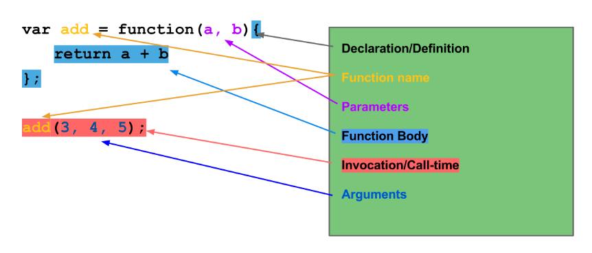

# Function In-depth

## Anatomy of a Function



### Defining a Function and Invoking/Calling a Function

When we define a function, it's static, it's not been run. Anything in the body
of the function, which is between two curly brackets, does not run until call
time or when we invoke it.

We call or invoke a function using brackets, or using a method like `call`
or `apply` or something like that.

### Difference Between Parameters and Arguments

Parameters is variable and they don't hold a value until the function got
called.

Arguments are what we pass to the function, they have values.

## Function Scavenger Exercise

Find definition, function names, where things are being
invocated, arguments, parameters, function bodies, where there
are return values, and where there are side effects from this
snippet below:
```javascript
var nameImprover = function (name, adj) {
  return 'Col ' + name + ' Mc' + adj + ' pants';
};

$('body').hide();

myArr.forEach(function (val) { console.log(val); });

$('button').on('click', function () {
  console.log('Don\'t press my button!');
});
```

> Return values are anything that explicitly returned (at least in ES5).
> Side effects are things that are happening other than returning the value
> that effects something outside of that function. `console.log`, for example,
> is a side effect because we're logging to the console that exists outside of
> that function. Another example of side effect is if we're changing the value
> of an object that's in a different scope.

### Function Scavenger Exercise Solution

- Function definition:
```javascript
// in the `nameImprover`
function (name, adj) {
  return 'Col ' + name + ' Mc' + adj + ' pants';
};

// in the callback function `myArr`
function (val) { console.log(val); }

// in the button
function () {
  console.log('Don\'t press my button!');
};
```

> How do we know that's a function definition? It says `function`, have brackets
> and parentheses, but isn't necessary invoke it.

- Function name:
```javascript
// in `var nameImprover = ...`
nameImprover

// in `${'body'}.hide()`
hide

// in `myArr.forEach(...)`
forEach

// in `$('button').on(...)`
on

// in `console.log(...)`
log

// in $('body') and $('button')
$
```

> The clue if it was a function name is that, it followed by parentheses.

- Function body:
```javascript
// in `var nameImprover = ...`
return 'Col ' + name + ' Mc' + adj + ' pants';

// in `myArr.forEach(...)`
console.log(val);

// in `$('button').on(...)`
console.log('Don\'t press my button!');
```

> The clue if it was a function body is, it's inside a curly brackets.
>
> What's the important thing that we need know about the function bodies?
> Function bodies not running until the function invoked.
>
> The clue when invoking a function is, there's a bracket after the function
> like `console.log(...)`, `$('body')`, `$('body').hide()`,
> `myArr.forEach(...)`, `$('button')`, `$('button').on(...)`.

- Parameters:
```javascript
// in `var nameImprover = function (name, adj) {...}`
name and adj

// in `myArr.forEach( function (val) {...})`
val
```

- Arguments:
```javascript
// in `$('body').hide()`
body

// in `$('button').on(...)`
button

// in `$('button').on('click', ...)`
click

// in `$('button').on('click', function () {...})`
function () {...}

// in `myArr.forEach(function (val) {...})`
function (val) {...}
```

- Return:
```javascript
// in `var nameImprover = function (...) {...}`
return 'Col ' + name + ' Mc' + adj + ' pants';
```

- Side effect:
```javascript
// in `myArr.forEach(function (val) {...})`
console.log(val);

// in `$('button').on(...)`
console.log('Don\'t press my button!');

// in `$('body').hide()`
// anything on the DOM is gonna be side effect
hide()
```

> A big part of functional programming is to minimize side effects as much
> as we can.
